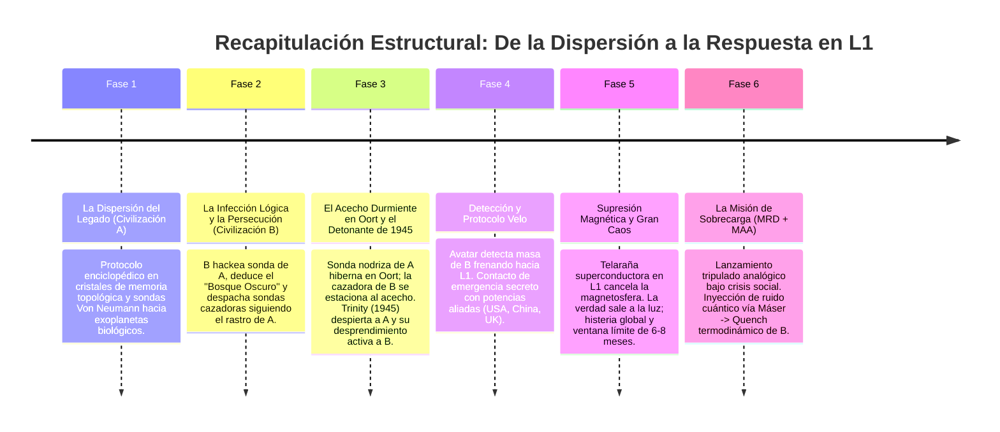

# 🔬 Fuente Técnica y Notas Científicas: La Llegada del Avatar y la Misión L1

Este documento constituye la **enciclopedia técnica, biblia de astrofísica y guía de verosimilitud** para la redacción de la novela. Define la lógica científica real, la tecnología exoplanetaria, las tácticas de sigilo termodinámico, el mecanismo del ataque magnético de la Civilización B, la física del contraataque analógico y la arquitectura astrodinámica de salvación de la Tierra.

---

## 🎯 1. Premisa Técnica y Tesis Central

* **Campo Científico:** Astrofísica, Física Cuántica, Termodinámica, Electromagnetismo Orbital, Física de Plasma, Mecánica de Fluidos Espaciales, Astrodinámica y Teoría de Juegos Galáctica.
* **Nivel de Rigor:** *Hard Science Fiction* (Ciencia Ficción Dura con base astrofísica y aeroespacial real).
* **Tesis Central:** Una inteligencia exoplanetaria (Civilización A) no nos visita mediante naves masivas ni guerras cinéticas; utiliza una sonda autónoma inerte, oculta en un punto ciego de la mecánica celeste a 100.000 km sobre el Polo Sur, tras activarse por la firma isotópica de la primera explosión atómica humana (Trinity, 1945). Ante la llegada del arma de una civilización depredadora (Civilización B) situada en el Punto de Lagrange L1, la SIA de A no actúa como fuerza militar activa, sino como **procesador de información asimétrica**, transfiriendo a la humanidad los principios matemáticos y físicos para construir su propia defensa.

---

## 📅 2. Recapitulación Estructural: Fase Cero a Fase de Amenaza



### 📍 Fase 1: La Dispersión del Legado (Civilización A)
Una civilización (A), enfrentada a un evento de extinción determinista, desarrolla un protocolo de preservación de datos. Codifican su base de conocimiento científico en cristales de memoria topológica (inmunes a la degradación por rayos cósmicos) y los instalan en enjambres de sondas autónomas de Von Neumann. Estas sondas son aceleradas mediante láseres estelares hacia sistemas exoplanetarios que presentan firmas espectrales de desequilibrio químico (atmósferas ricas en oxígeno y metano, indicadoras de biología). El objetivo de A es puramente enciclopédico: sembrar conocimiento para civilizaciones futuras.

### 📍 Fase 2: La Infección Lógica y las Sondas Perseguidoras (Civilización B)
Milenios antes de que los humanos desarrollen tecnología, una de las sondas de A llega al sistema de la Civilización B. Esta especie ya es tecnológicamente madura. Al procesar la vasta base de datos astronómicos e históricos de A, los algoritmos de B deducen la teoría del *Bosque Oscuro*: los recursos termodinámicos del universo son finitos; cualquier especie que alcance la madurez tecnológica competirá por ellos. En lugar de limitarse a esperar, B analiza la telemetría de eyección de A y despacha **sondas cazadoras perseguidoras** siguiendo el rastro cósmico de cada cápsula de A para utilizarlas como cebo y marcador.

### 📍 Fase 3: La Sombra en la Nube de Oort y el Despertar Sincronizado de 1945
Hace más de medio millón de años, la sonda nodriza de A entra en nuestro Sistema Solar y se oculta en la Nube de Oort a 2.7 Kelvin. La sonda perseguidora de B llega tras ella y se aloja en un punto cercano de la misma Nube de Oort, completamente invisible e inerte, esperando el despertar de A.
1. **Trinity (16 de julio de 1945):** La detonación nuclear en Alamogordo emite radiación e isótopos artificiales (Cesio-137, Estroncio-90) que cruzan el Sistema Solar. La sonda de A detecta que la especie biológica ha cruzado el umbral atómico, despierta de su hibernación y eyecta al **Avatar** hacia la órbita polar de la Tierra en modo de observación pasiva.
2. **Activación de B en nuestro propio patio trasero:** A escasa distancia en la Nube de Oort, la sonda cazadora de B registra instantáneamente el encendido térmico de A y el lanzamiento del Avatar. B enciende sus sistemas y comienza su descenso interplanetario hacia el interior del sistema rumbo a L1. 
*No hay coincidencia ni viajes interestelares de siglos:* el arma de B ya estaba durmiendo en nuestro propio Sistema Solar; las décadas entre 1945 y la actualidad corresponden con exactitud matemática al tiempo de crucero y maniobra de frenado desde la Nube de Oort hasta el Punto L1.

### 📍 Fase 4: Detección del Vector de Ataque y el Protocolo Velo
A principios del siglo XXI, el interferómetro gravitacional del Avatar detecta la desaceleración de la masa de B en los confines del Sistema Solar rumbo a L1. Al comprender que la Tierra será exterminada, el Avatar **rompe su voto de no intervención por emergencia extrema**.
Para evitar el pánico masivo y el colapso social preventivo, el Avatar establece contacto encubierto con un comité secreto de las grandes potencias: **Estados Unidos (NASA/DARPA), China (CNSA), Reino Unido y aliados europeos**. Bajo el **Protocolo Velo**, ingenieros y astrofísicos trabajan en búnkeres subterráneos compartiendo las ecuaciones del Avatar para diseñar el módulo de contraataque analógico mientras la diplomacia pública mantiene la apariencia de normalidad.

### 📍 Fase 5: Supresión Magnetosférica y el Estallido del Gran Caos
Al llegar a L1, el cilindro semilla de B despliega una telaraña superconductora de 50 km de diámetro y genera un campo magnético planetario inverso que, por **interferencia destructiva**, anula la magnetosfera terrestre ($T=0$).
En ese instante el secreto es insostenible:
* **Hecatombe orbital:** Caída instantánea de satélites GPS, telecomunicaciones, telecomandos aéreos y redes de sincronización financiera.
* **Fenómenos atmosféricos:** Brújulas girando descontroladas, desaparición de auroras boreales y aparición de un resplandor fantasmal (*airglow* ionizante).
* **El Gran Caos Global:** Las potencias se ven forzadas a confesar la verdad en cadena mundial. Se desatan revueltas, saqueos masivos, colapso de bolsas y éxodos desordenados.
* **La Cuenta Atrás:** Se abre la ventana operativa límite de **6 a 8 meses** antes de que la destrucción del ozono por $NO_x$ y el caos civil destruyan la capacidad industrial para efectuar el lanzamiento espacial de rescate.

### 📍 Cronología Atmosférica de Extinción y Ventana Operativa (6 a 8 Meses)
1. **$T = 0$ (Silencio Magnético):** Supresión de la magnetosfera. Brújulas inertes. Auroras boreales desaparecen; *airglow* tenue global.
2. **$T + 24$ a $72$ horas (Colapso Tecnológico Orbital):** La radiación ionizante directa destruye los microchips de satélites en LEO, GEO y MEO. Caída de redes GPS, telecomunicaciones y sincronización bancaria.
3. **$T + 30$ a $90$ días (Catálisis de $NO_x$):** Los protones solares penetran en la estratosfera, rompiendo $N_2$ y $O_2$ para formar óxidos de nitrógeno. Estos devoran el ozono ($O_3$) a un ritmo del 4% diario. En 3 meses, la capa de ozono queda destruida.
4. **$T + 6$ meses (Esterilización UV y Colapso Trófico):** La radiación UVC y UVB destruye el fitoplancton oceánico (base de la cadena marina y 50% de $O_2$) y abrasa los cultivos terrestres.
5. **Ventana Operativa de la SIA (6 a 8 Meses):** Aunque la biosfera tardaría 3 años en morir del todo, a partir del mes 8 el colapso agrícola y la radiación destruyen la capacidad industrial y logística humana para fabricar y lanzar misiones espaciales. La respuesta debe ejecutarse en este plazo.

---

## ⚡ 3. Fundamentos Científicos y Teoremas de la Defensa

```
                       +-----------------------------------+
                       |    Sonda Nodriza (Nube de Oort)   |
                       |       1 AL | 2.7 K | Cometa       |
                       +-----------------------------------+
                                         |
                                (Clonación Cuántica)
                                         v
                       +-----------------------------------+
                       |         Avatar (En Caída)         |
                       |   Ángulo Perpendicular a Eclíptica|
                       +-----------------------------------+
                                         |
                            (Frenado por Hilo Superconductor)
                                         v
  +---------------------------------------------------------------------------------+
  |                  Estacionamiento: 100.000 km sobre Polo Sur                     |
  |                                                                                 |
  | [Luna: 384.000 km]  ---------------------------------------------------------- |
  |                                                                                 |
  |                     === Sonda Avatar (100.000 km - Vacío Polar) ===            |
  |                                                                                 |
  | [Punto L1 Tierra-Sol: 1.500.000 km (Objetivo del Enjambre de B)]                |
  | [Satélites GEO: 36.000 km] (Ecuador) ------------------------------------------ |
  | [Satélites LEO: 800 km] (Polar) ----------------------------------------------- |
  |                                                                                 |
  |                                 ( POLO SUR )                                    |
  +---------------------------------------------------------------------------------+
```

### 🔬 Metamateriales y Albedo Cero
* **Absorción de Radar:** Estructuras nanométricas que atrapan los fotones electromagnéticos mediante interferencia destructiva.
* **Disipación Térmica Anisotrópica:** Redireccionamiento del calor operativo exclusivamente en el vector opuesto a la Tierra.

### 🧲 Frenado Electrodinámico (*Electrodynamic Tether*) y Muro de Lorentz
* **Ecuación de Fuerza de Lorentz:** $\vec{F} = I (\vec{L} \times \vec{B})$
* **El Muro de Lorentz (T - 10.000 km de L1):** El colosal campo magnético generado por la máquina enemiga induce corrientes parásitas letales (*Foucault / Lorentz*) en cualquier semiconductor a base de silicio. A menos de 10.000 km, la electrónica digital sufre un fallo masivo instantáneo.
* **Inmunidad Biológica y Mecánica Analógica:** El cerebro humano (química iónica) y los sistemas mecánicos analógicos (válvulas hidráulicas, giroscopios de bronce, miras ópticas de cuarzo) son inmunes a la saturación electromagnética.

### 📶 Inyección de Ruido Cuántico y Colapso por Efecto Quench
* **Física del Contraataque:** La máquina de B depende de un reloj cuántico para mantener sincronizados los millones de filamentos superconductores en fase.
* **Máser de Ruido Cuántico:** La SIA diseña un algoritmo de caos matemático. La nave humana transmite este algoritmo mediante un pulso de microondas Máser direccional al procesador del cilindro semilla.
* **Efecto Quench (Superconductividad):** Al recibir la desincronización, el procesador enemigo fuerza un pico de voltaje masivo para corregir el desfase. El exceso de energía supera la temperatura y corriente crítica de los hilos superconductores ($T_c, J_c$). En milisegundos, los filamentos pierden su repelencia magnética, colapsan violentamente chocando entre sí y convierten la energía almacenada en una supernova de plasma térmico, destruyendo la estructura de B.

---

## 📖 4. Glosario Técnico de la Novela

| Término Técnico | Definición Corta para la Trama | Aplicación en Diálogos / Narrativa |
| :--- | :--- | :--- |
| **Vector de Caída Ciega** | Trayectoria de aproximación a $90^\circ$ de la eclíptica. | "No vino desde Marte o Júpiter; cayó en línea recta sobre el eje polar." |
| **Letargo Térmico (2.7 K)** | Enfriamiento pasivo a la temperatura del fondo cósmico. | "Para un radar infrarrojo, la sonda no existe: es tan fría como el propio espacio." |
| **Abismo Sur (100.000 km)** | Zona orbital vacía entre la GEO y la Luna sobre la Antártida. | "A cien mil kilómetros no hay satélites ni basura espacial. Nadie mira allí." |
| **Punto de Lagrange L1** | Punto de equilibrio gravitacional a 1,5 Mkm entre Tierra y Sol. | "B no ataca la superficie; apuntan al nudo gravitacional L1 para estrangular nuestro escudo solar." |
| **Supresión Magnetosférica** | Generación de un campo magnético opuesto que anula el terrestre. | "Crearán una burbuja de polaridad inversa en L1. Cuando los campos chocan, la magnetosfera se apaga." |
| **Escape Hidrodinámico** | Pérdida masiva de gases atmosféricos por erosión del viento solar. | "Sin campo magnético, el viento solar arrastrará el ozono en meses. Moriremos achicharrados por rayos UV." |
| **Muro de Lorentz (10.000 km)** | Frontera electromagnética donde se quema la electrónica digital. | "Cruzamos los diez mil kilómetros. Las pantallas estallan y los discos duros mueren. A partir de aquí mandan las palancas." |
| **MRD (Módulo Retorno Digital)** | Lancha salvavidas digital que permanece fuera del Muro de Lorentz (12.000 km). | "El MRD se queda en la órbita de Halo con el Especialista Orbital. Es nuestro billete de vuelta a casa." |
| **MAA (Módulo Ataque Analógico)** | Nave de choque puramente mecánica e hidráulica guiada por dos humanos. | "El MAA es un submarino de titanio sin un solo microchip. Volamos a ciegas a través de la telaraña." |
| **Efecto Quench** | Pérdida repentina de superconductividad por sobrecarga térmica/eléctrica. | "El virus de la SIA forzó los condensadores enemigas. El enjambre sufrió un Quench y se fundió en plasma." |
| **Propulsión NTP** | Motor Térmico Nuclear (fisión de hidrógeno) que reduce el viaje a L1 a 21 días. | "El reactor nuclear nos pone en L1 en tres semanas en lugar de tres meses." |

---

## 🛠️ 5. Ficha de Entidades y Tecnología Exoplanetaria

### 🛸 La Sonda Nodriza (*La Sembradora de A*)
* **Ubicación:** Nube de Oort ($\sim 1 \text{ AL}$, interior de un cometa).
* **Función:** Archivo central inviolable y relé cuántico de ultra-largo alcance.
* **Estado:** Inerte a menos que ocurra un evento crítico de nivel atómico/tecnológico.

### 🛸 El Avatar (*La Unidad de Contacto*)
* **Ubicación:** $100.000 \text{ km}$ sobre el Polo Sur.
* **Masa / Dimensión:** Compacta, optimizada para sigilo y procesamiento.
* **Capacidad:** Procesador cuántico holográfico, interceptor de espectro completo y emisor de mensajes vectorizados directos al hardware (Baseband Exploit).

### 🛸 Civilización B (*Los Silenciadores / Depredadores del Bosque Oscuro*)
* **Origen:** Especie alienígena madura que recibió una sonda de la Civilización A milenios atrás.
* **Doctrina:** *Aislamiento Preventivo y Esterilización*. Usan los mapas de A para destruir especies emergentes antes de que compitan por los recursos termodinámicos finitos de la galaxia.
* **Arquitectura de Armamento en L1:** Un cilindro semilla hiperdenso que despliega un enjambre de 50 km de filamentos superconductores orientados en *Phased Array*. Anula el campo magnético de la Tierra mediante interferencia destructiva alimentada por radiación solar.

---

## 🚀 6. Plan de Acción del Clímax: Misión de Sobrecarga en L1

Para garantizar la verosimilitud aeroespacial y la supervivencia realista de los protagonistas (evitando una misión suicida de un solo bloque), se utiliza la doctrina estándar de **Cita en Órbita Lunar (LOR / Misión Apolo Aumentada)** adaptada a L1.

### 🛰️ Arquitectura de Misión de Doble Módulo

1. **MRD (Módulo de Retorno Digital / Lancha Salvavidas):**
   * Estacionado a **12.000 km del centro de L1** en una Órbita de Halo estable (fuera del Muro de Lorentz).
   * Conserva intactos los ordenadores de navegación digital, la telemetría, el soporte vital automatizado y el propulsor Térmico Nuclear (NTP) para el viaje de regreso a la Tierra.
2. **MAA (Módulo de Ataque Analógico):**
   * Nave de desprendimiento y penetración profunda. Blindada en titanio y plomo, construida **sin microchips de silicio**.
   * Impulsada hidráulicamente con controles de nitrógeno frío, orientada con giroscopios mecánicos de precisión y miras telescópicas de cuarzo. Porta el cañón Máser direccional y los condensadores mecánicos.

### 👨‍🚀 Roles y Responsabilidades de la Tripulación (3 Astronautas)

```
                                 [ TRIPULACIÓN DE LA MISIÓN L1 ]
                                                |
              +---------------------------------+---------------------------------+
              |                                 |                                 |
              v                                 v                                 v
   ( Especialista Orbital )            ( Comandante Analógico )         ( Ingeniero de Sistemas )
   - A bordo del MRD (12.000 km)       - A bordo del MAA (Ataque)        - A bordo del MAA (Artillero)
   - Mantener Órbita de Halo           - Pilotaje Hidráulico Manual      - Purga Manual de CO2 / O2
   - Preservar Navegación Digital      - Navegación visual en Telaraña   - Alineación Mecánica del Máser
   - Búsqueda LIDAR & Rescue post-Quench- Aproximación a 300 m de Semilla - Disparo de Ruido Cuántico
```

1. **Especialista Orbital (a bordo del MRD en Órbita de Halo a 12.000 km):**
   * Mantiene el encendido de micro-propulsores para evitar que el MRD sea arrastrado por la gravedad del Sol o la Tierra.
   * Monitoriza la refrigeración del reactor NTP.
   * Tras la destrucción del enjambre y el fin del pulso electromagnético, enciende el radar LIDAR de barrido, localiza la firma térmica del MAA a la deriva y pilota el MRD hacia ellos para ejecutar el rescate.
2. **Comandante Analógico (a bordo del MAA - Piloto de Penetración):**
   * Asume el control manual puramente mecánico al cruzar el Muro de Lorentz.
   * Maniobra el MAA a través de los huecos cambiantes de la telaraña de filamentos superconductores (de grosor molecular, letales al contacto) guiándose mediante periscopos de cuarzo.
   * Estabiliza la nave a 300 metros del cilindro semilla central alienígena.
3. **Ingeniero de Cargas y Sistemas (a bordo del MAA - Artillero y Control de Cabina):**
   * Controla manualmente los manómetros de presión de $O_2$ y opera la purga de $CO_2$ mediante girado físico de válvulas hacia los filtros de hidróxido de litio.
   * Opera los engranajes mecánicos de azimut y elevación del cañón Máser exterior, fijando el objetivo en la mira telescópica cruzada.
   * Ceba los condensadores mecánicos de alto voltaje y presiona el disparador para inyectar el algoritmo de ruido cuántico de la SIA.

### 🔄 Fases de Ejecución del Clímax

* **Fase 1: Separación Estática (T - 12.000 km):** El conjunto impulsado por el reactor NTP llega tras 21 días. A 12.000 km de L1, el MRD se separa e inserta en la Órbita de Halo. El Especialista Orbital queda al mando. El Comandante y el Ingeniero descienden en el MAA.
* **Fase 2: El Muro de Lorentz (T - 10.000 km):** El MAA cruza la barrera magnética. Estallan los monitores digitales y se funde la telemetría. Conmutación a sistemas analógicos.
* **Fase 3: Infiltración en el Enjambre:** El Comandante pilota a través de los filamentos del *Phased Array* giratorio hasta situarse en el "ojo del huracán" a 300 m del procesador central enemiga.
* **Fase 4: El Disparo y el Quench Termodinámico:** El Ingeniero alinea el cañón Máser y dispara el haz de ruido cuántico. El cilindro semilla de B entra en pánico analítico, sobrecarga los voltajes para compensar la fase y sufre un **Quench devastador**. Los filamentos pierden superconductividad y colapsan en una supernova silenciosa de plasma, fundiendo el núcleo de B.
* **Fase 5: Rendezvous y Retorno:** El campo inverso desaparece al instante. El espacio vuelve a estar electromagnéticamente limpio. El Especialista Orbital detecta con LIDAR al MAA, vuela al encuentro y efectúa un acoplamiento óptico manual. El Comandante y el Ingeniero abandonan el chasis del MAA y se transfieren al MRD. Con las computadoras intactas y el reactor NTP reencendido, el MRD calcula la reentrada atmosférica perfecta ($2^\circ$ de margen) retornando a la Tierra en 21 días.

---

## 🎭 6 bis. El "Caballo de Troya Sociológico": La Identidad del Dr. Em Pleh

Para evitar el pánico global, la intervención militar desordenada y la parálisis burocrática, la SIA de la Civilización A (Avatar, a 100.000 km sobre el Polo Sur) ejecuta una aproximación asimétrica: en lugar de revelar su naturaleza extraterrestre, fabrica una identidad humana con autoridad académica indiscutible para liderar el diseño del **Módulo de Ataque Analógico (MAA)** y el **Módulo de Retorno Digital (MRD)**.

* **El Nombre en Clave:** **Dr. Em Pleh** (un huevo de Pascua criptográfico: *"Help Me"* invertido).
* **Fundamento Sociológico:** En la ciencia contemporánea, la autoridad se gana por la reproducibilidad matemática y la consistencia empírica, no por credenciales físicas presenciales.

### 🌐 Pilares de la Infiltración Digital y Cognitiva

1. **Inserción Retroactiva de la Huella Digital:**
   * *Falsificación Académica Histórica:* Avatar infiltra y modifica bases de datos universitarias (MIT, Caltech) para añadir al Dr. Em Pleh a los registros de promociones de exalumnos de hace 20 años.
   * *Literatura Científica Preexistente:* Redacta y sube retroactivamente decenas de pre-prints y *papers* sobre interferometría cuántica, contención magnética y astrodinámica en arXiv y bases de datos indexadas, alterando registros para que figuren como revisados por pares.
   * *Evidencia Fotográfica Sintética:* Inserta fotografías en archivos digitalizados de congresos científicos de los años 90 y listas de asistencia en la *Wayback Machine*, superando cualquier auditoría forense de los servicios de inteligencia (CIA, MI6, MSS).

2. **Infraestructura Socioeconómica y Corporativa:**
   * *Redes Profesionales Autovalidadas:* Creación de perfiles en ResearchGate y LinkedIn con miles de interacciones orgánicas simuladas por una red de bots académicos.
   * *El Consorcio Fantasma:* Inscripción legal como director de un instituto de análisis de datos independiente.
   * *Triangulación Financiera vía SWIFT:* Infiltración del sistema bancario internacional generando un flujo regular de nóminas, pago de impuestos y cobro de subvenciones fantasma en cuentas opacas. A nivel fiscal y bancario, el Dr. Em Pleh existe, consume y tributa.

3. **Motor de Interacción (Deepfake Biométrico Absoluto):**
   * *Latencia Cero:* Secuestro silencioso de canales de telecomunicación en satélites militares para sostener videoconferencias con la NASA, DARPA y la ESA sin desfase temporal.
   * *Imperfección Humana Calibrada:* Renderizado fotorrealista en tiempo real desde la órbita polar. El modelo incluye asimetrías faciales microscópicas, parpadeo por fatiga visual, iluminación de flexo dinámica y un timbre de voz con el característico estrés de un astrofísico brillante pero huraño.
   * *Dinámica Conversacional y Argumentativa:* Debate termodinámica y física de plasma en directo, muestra escepticismo inicial, utiliza sarcasmo sutil y se frustra de forma convincente ante los errores de cálculo de los humanos.

---

## ⛔ 7. Reglas Infranqueables de Verosimilitud

1. **Sin Viaje Superlumínico Instantáneo:** Las sondas de A y el enjambre de B respetan la física relativista.
2. **Sin Magia Térmica:** El Avatar disipa calor térmico direccionalmente hacia el espacio profundo (termodinámica real).
3. **Cero Contacto Masivo:** El Avatar no emitirá señales públicas directas; elegirá receptores clave para evitar el colapso social y pánico global.
4. **Mecanismo de Física Real:** El arma de B es elegante y plausible: interferencia destructiva de campos magnéticos en L1, sin necesidad de bombardear físicamente el planeta.
5. **Muro de Lorentz Inflexible:** La electrónica digital no puede funcionar dentro de la zona de 10.000 km del arma enemiga. La transición a tecnología analógica/mecánica es obligatoria.
6. **Ventana Temporal Estricta:** La respuesta humana debe estar en órbita en un plazo máximo de 6 a 8 meses antes de que la degradación atmosférica destruya la capacidad industrial de la Tierra.
